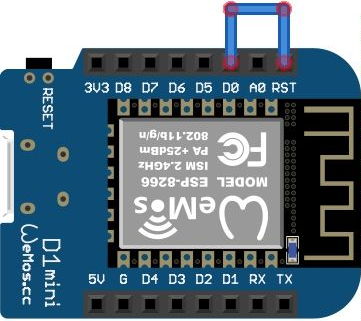

Blink your LED when a satellite is passing by!


This is a small side-project I had for a long time ago but this time I wanted to port it inside the Wemos D1 mini, an ESP8266 microchip that provides a WiFi interface.

## Installation

### Flash Micropython into your ESP8266 board
[Download](https://micropython.org/download/esp8266/) and flash Micropython following the instructions from the [official website](http://docs.micropython.org/en/latest/esp8266/tutorial/intro.html#intro).

After choosing a firmware, these are roughly the steps for any recent Debian distro,
```bash
$ wget https://micropython.org/resources/firmware/esp8266-20191220-v1.12.bin
$ pip install esptool
# Connect the board on a USB port
$ esptool.py --port /dev/ttyUSB0 --baud 460800 write_flash --flash_size=detect 0 esp8266-20191220-v1.12.bin
```

### Check that it's working
Once firmware is flashed, you can enter the Python REPL by serial USB connection. You can just use GNU `screen` setting the baudrate at 115200, but I'd recommend to install [mpfshell](https://github.com/wendlers/mpfshell) so that we can upload and manage the files later.

```bash
$ mpfshell ttyUSB0
Connected to esp8266

** Micropython File Shell v0.9.1, sw@kaltpost.de ** 
-- Running on Python 3.7 using PySerial 3.4 --

mpfs [/]> repl
```

Write `repl`, hit Enter and you're inside Python REPL! You can exit with `Ctrl+]`

Inside `mpshell` you can write `help` to list all commands.

### Wire RST pin
This is a requirement to wake up the ESP8266 from deep sleep. The reason is, after fetching the next pass, the code instructs the board to deep sleep until the next pass to save battery. 

When the chip triggers the RTC alarm to wake up, it sends a voltage on pin `D0`, so in order reset the board, we need to wire `D0` pin to `RST` pin like this,



### Connect a LED
Connect a LED to `D2` (GPIO 4) and ground. You can choose another pin and update `config.py` later.

## Run
Clone the repo, copy or rename `config.py.example` to `config.py` and set your own variables.

- `NORAD_ID` is the unique number to identify any satelitte, for example the International Space Station is `25544`.
- `LAT` / `LON` coordinates
- `ONLY_VISIBLE` is based on API response's `visible` field, which tells if the pass would be probably visible to naked eye according to certain conditions. You can check the API [source code](https://github.com/redraw/satellite-passes-api), or read more [here](https://www.heavens-above.com/faq.aspx)
- `WIFI_SSID` / `WIFI_PASS` , your WiFi credentials.

### Upload the code
Enter `mpshell` so that we can upload the files,

```bash
mpfs [/]> mput .*\.py
```

Now, just reset the board and that's it (hopefully!).

## Known Issues with RTC
RTC clock in ESP8266 is said to not be very accurate. That's why in `boot.py` it syncs with an NTP server using `ntptime` at every reset, but I can't be sure if deep sleeping for long hours would drastically drift clock time.
